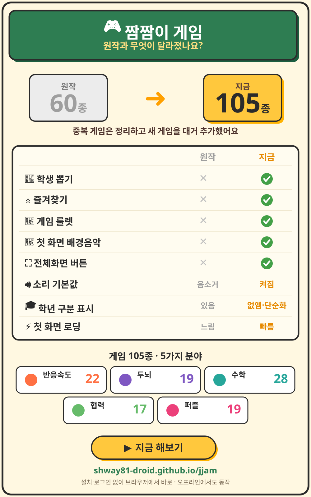

# 🎮 짬짬이 게임

**전자칠판으로 즐기는 자투리 시간 초등 미니게임 105종.**
설치도 로그인도 없이 브라우저에서 바로 시작하고, 인터넷이 끊겨도 동작합니다.

▶️ **바로 하기 → https://shway81-droid.github.io/jjam/**

원작 [짬짬이 교실](https://shway81-droid.github.io/jjamjjami-gyosil/)(게임 60종)을 기반으로,
**게임을 105종으로 늘리고 교실에서 바로 쓰는 운영 도구를 더한** 후속 버전입니다.

## ✨ 주요 기능

- **🎲 게임 고르기, 쉽고 빠르게** — 큼직한 게임 카드 그리드 + "룰렛으로 골라줘" 버튼 + 카테고리 필터 + ⭐ 즐겨찾기(자주 쓰는 게임을 맨 위에 고정). 룰렛은 카테고리 필터를 켜 둔 상태면 그 안에서만 뽑습니다.
- **🙋 학생 뽑기** — 번호만 입력해 발표·순서를 정하는 추첨기. 한 번 뽑힌 번호는 다시 안 나오고(비복원), 전원이 다 뽑히면 자동으로 리셋됩니다. *이름 없이 번호만 쓰므로 개인정보 걱정이 없습니다.*
- **🔊 교실 환경 최적화** — 1280·1920px 대화면에서 글씨·버튼이 자동으로 커지고, 조작 요소는 학생 손이 닿는 화면 아래쪽에 배치됩니다. 교실 스피커를 전제로 **소리 기본 ON**.
- **🎵 첫인상까지** — 첫 화면에 흐르는 배경음악, 전자칠판에 맞춘 보드게임풍 디자인(펠트 그린·우드 프레임·골드 버튼), 우상단 **전체화면** 버튼.
- **📴 오프라인 동작** — PWA + 서비스 워커로 한 번 열어 두면 인터넷 없이도 플레이됩니다(학교 크롬북·태블릿).

## 원작과 달라진 점



| 항목 | 원작 (jjamjjami-gyosil) | 이 버전 (jjam) |
|---|---|---|
| 게임 수 | 60종 | **105종** (중복 메커니즘 정리 + 신규 대거 추가) |
| 학생 뽑기 | ✗ | ✅ 번호 비복원 추첨 (개인정보 없음) |
| 즐겨찾기 | ✗ | ✅ ⭐ 상단 고정 |
| 게임 룰렛 | ✗ | ✅ 카테고리 필터 연동 |
| 첫 화면 배경음악 | ✗ | ✅ |
| 전체화면 버튼 | ✗ | ✅ |
| 소리 기본값 | 음소거 | **켜짐** |
| 학년 구분 표시 | 있음 | 없앰 (화면 단순화) |
| 첫 로딩 | 게임마다 개별 요청 | 통합본 1요청으로 단축 |

## 게임 105종 (카테고리 분포)

⚡반응속도 22 · 🧠두뇌 19 · 📐수학 28 · 🤝협력 17 · 🧩퍼즐 19

게임 선별·삭제 기준은 [docs/SELECTION.md](docs/SELECTION.md)에, 새 게임을 추가할 때 피하는
안티패턴은 [docs/GAME_ANTIPATTERNS.md](docs/GAME_ANTIPATTERNS.md)에 정리되어 있습니다.

## 구조 (개발자용)

```
index.html          # 런처 (룰렛·학생 뽑기·즐겨찾기·게임 그리드)
shared/style.css    # 공통 스타일 + 보드게임 테마 레이어
shared/engine.js    # 타이머·점수판·Web Audio 효과음/배경음악·onTap
shared/jjam-switcher.js # 헤더의 자매 사이트 바로가기 (네 저장소 공통, 여기가 상류)
games/<폴더>/        # 게임별 game.json + index.html + style.css + game.js
games/registry.json # 게임 목록
games/meta.json     # 전 게임 메타 통합본 (런처가 1요청으로 받음, gen-metadata 생성)
sw.js               # 오프라인 서비스 워커
assets/fonts/       # 자가 호스팅 웹폰트 (Pretendard 서브셋, OFL 1.1)
scripts/verify-game.js  # 게임 1개 정적 검증 21항목 (node scripts/verify-game.js <폴더>)
scripts/verify-all.js   # 전 게임 일괄 검증 + registry 정합성 (npm test)
scripts/gen-metadata.js # game.json → 파생 메타 생성 (npm run gen)
scripts/browser-verify.js       # 실제 브라우저로 자동 플레이 (npm run verify:browser)
scripts/check-font-coverage.mjs # 서브셋 폰트에 없는 글자가 생겼는지 확인
```

### 메타데이터 단일 소스

게임의 `category`(필터·BGM 분류)와 `players`(인원 배지)는 **`game.json`에만** 둔다.
런처의 `FALLBACK_GAMES`·`engine.js`의 `_GAME_CATEGORY_MAP`·`games/meta.json`(런처가 런타임에
1요청으로 받는 전 게임 메타 통합본)은 `game.json`에서 `scripts/gen-metadata.js`가 자동 생성한다.
게임을 추가·수정하면:

```
npm run gen   # 파생 메타 재생성 (engine.js / index.html / games/meta.json)
npm test      # 동기화 확인(gen --check) + 전 게임 정적 검증 (CI와 동일)
```

CI(`.github/workflows/ci.yml`)가 PR마다 `npm test`로 동기화·검증을 강제한다.

### 검증 두 겹 — 정적 + 실제 브라우저

`npm test`는 파일 구조·메타 동기화 같은 **정적** 검사라 "게임이 실제로 돌아가는가"는 못 본다.
그 자리를 `scripts/browser-verify.js`가 메운다 — 게임을 크로미움으로 띄워
**인트로 → PLAY → 카운트다운 → 라운드 → 결과화면**까지 자동 플레이하고 콘솔 에러 0을 확인한다.

```
npm run verify:browser -- <폴더> [<폴더> ...]   # 특정 게임
npm run verify:browser -- --all --jobs=4        # 전 게임
```

`.github/workflows/browser.yml`이 **PR에서는 그 PR이 건드린 게임만**, main 푸시·매주 월요일에는
전 게임을 돈다. (전 게임이 로드하는 `shared/style.css`·`shared/engine.js`나 하니스 자체가
바뀌면 PR에서도 전 게임을 돈다 — 전체에 영향이 가므로.)

조작 방식이 달라 자동 플레이가 안 되는 게임(타일 배치·드래그·시퀀스 재현 등)은 **실패가 아니라
△로 구분해 보고**한다. 그 게임도 로딩·PLAY·게임화면 진입·콘솔 에러 0 까지는 확인된다.

## 사이트 아이콘

브라우저 탭·헤더 로고·앱 아이콘이 모두 **`favicon.svg` 한 파일**에서 나옵니다.
헤더 로고도 이 파일을 그대로 쓰므로 탭과 화면이 어긋날 일이 없습니다.

짬짬이 4개 사이트는 **같은 틀 + 다른 알맹이**입니다 — 둥근 사각형 타일과 우상단
배지(흰 원 + 네이비 시계, “자투리 시간”)는 넷이 같고, 바탕색과 가운데 심볼만 다릅니다.
게임 앰버 `#FFB703` · 퀴즈 그린 `#12A57C` · 영상 스카이 `#4FA8E8` · 이야기 퍼플 `#6145B5`.

홈 화면용 PNG는 `assets/icons/`에 있습니다. 안드로이드·iOS 홈 화면은 SVG를 쓰지 않아
PNG가 따로 필요합니다(없으면 “홈 화면에 추가”에서 아이콘이 비어 보입니다).

아이콘을 고쳤다면 `favicon.svg`만 수정한 뒤 `npm run gen:icons`로 PNG를 다시 만듭니다.

## 자매 사이트 바로가기

헤더 오른쪽 끝에 **짬짬이 퀴즈·영상·이야기로 바로 가는 버튼 세 개**가 있습니다.
선생님에게는 넷이 "자투리 시간에 쓰는 짬짬이" 하나인데, 지금까지는 한 곳에 들어오면
나머지 셋이 있다는 걸 알 방법이 없었습니다.

아이콘만 두는 안도 검토했지만, 처음 보는 사람은 그 그림이 "다른 사이트로 가는 것"인 줄
모릅니다(구글의 점 아홉 개처럼 이미 학습된 기호가 아닙니다). 그래서 **아이콘 아래에 이름**을
붙였습니다. 좁은 화면(720px 이하)에서는 이름을 감추고 아이콘만 남깁니다 — 글자를 줄여
잘리게 두는 것보다 낫습니다.

오프라인에서는 흐리게 표시되고 눌러도 이동하지 않습니다. 네 사이트는 캐시가 따로라
인터넷 없이 건너갈 수 없는데, 그냥 이동시키면 **지금 쓰던 화면까지 잃기** 때문입니다.

내용·스타일·아이콘이 모두 **`shared/jjam-switcher.js` 한 파일** 안에 있습니다. 네 사이트의
CSS 구조가 서로 달라, 같은 규칙을 네 CSS에 복사해 두면 또 어긋나기 때문입니다.
넣는 쪽은 헤더에 host 한 줄뿐입니다.

```html
<div class="jjam-switch" data-site="game"></div>   <!-- 지금 있는 곳 -->
<script src="shared/jjam-switcher.js" defer></script>
```

이 파일은 **네 저장소에서 글자 하나까지 같아야 합니다.** jjam이 상류이고, 나머지 셋은
`node scripts/sync-shared.mjs`로 받아 맞춥니다(매일 워크플로가 이탈을 확인).
주소·이름·아이콘을 고칠 때는 여기서 먼저 고쳐 머지하세요.

## 로컬 실행

```
python -m http.server 8000
# http://localhost:8000
```
